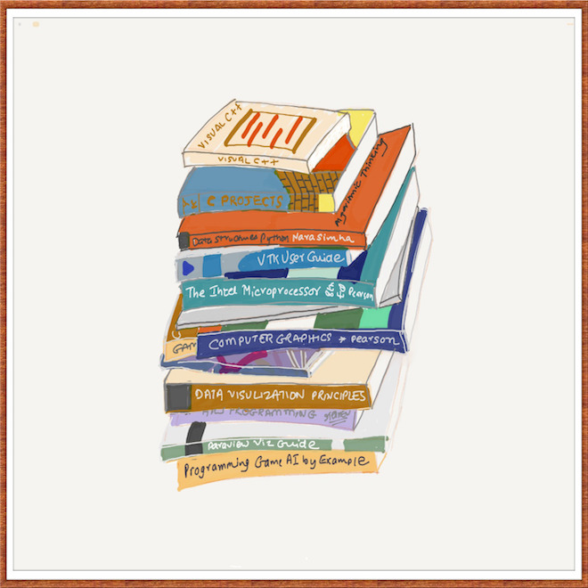

I have discovered that I used to over estimate the value that books bring to
the table, whenever I have tried to learn a new skill or a new tool.

I think that could be beacause in reality I would learn something new to not
just learn it, but to apply it somewhere. Such (valid) applications of any
skill or tool are potentially infinite. As no book can cover all potential
applications or usage of a skill or a tool, I would come unstuck when applying
the knowledge gained. With experience, I have now changed my method of using
books.

The first part I use a book for is to gain a conceptual understanding of the
skill or the tool and for such an understanding, I have found it is unnecessary
to deep dive [1] into the book working my way systematically through it. [2]

The second and most important part is I then choose to work upon an application
of the skill or tool I have selected to learn, while using a book as one of the
tools in the process. By doing that I am more focused on producing things which
is what matters finally as opposed to the false expectations and satisfaction
gained by working through a book.

I now treat a book as an aid, a tool, a mentor, a navigator that I refer to
when I am stuck instead of the earlier feeling of being stuck despite having
worked through a book.

The only care I have to take in this process is to pick a good useful
application to work upon, which is possible if I am willing to think through it
enough and then there is [this](http://www.google.com/).

The other minor advantage I have gained by following this process is that I do
not suffer from the pressure of having to complete a book cover to cover. In
fact, I now do not even have to care if I will ever complete the book, as long
as it provides me value as a tool.

To cite just one example, recently I wanted to learn about algorithms and data
structures. So instead of working my way through books; I picked up [this book]
(http://www.amazon.com/Introduction-Design-Analysis-Algorithms-2nd/dp/0321358287),
and understood the concepts. Just the first 2 chapters sufficed. Next I chose
to actually [find applications where algorithms are
important](http://www.itasoftware.com/careers/puzzle_archive.html) part of the
solution. I chose to work on those applications, while using the books as a
tool. [Not only did this process
work](http://www.deepaksurti.com/blog/word-numbers-ita-archived-puzzle-solved),
but it also taught me how to actually use algorithms in the real world instead
of working on some descoped abstract problems in a textbook.

Overall, I have repeated this process more than once and I have found it to be
more productive in learning a skill or a tool than just working through a book.
And I plan to stick to it as of now.

---

[1] A purely systemtatic theoretical perusal could be useful, but I fail to
realize what is the point of theory if it does not lead to something useful?
May be I am missing something here!

[2] Anyways, just reading through books is useless.
