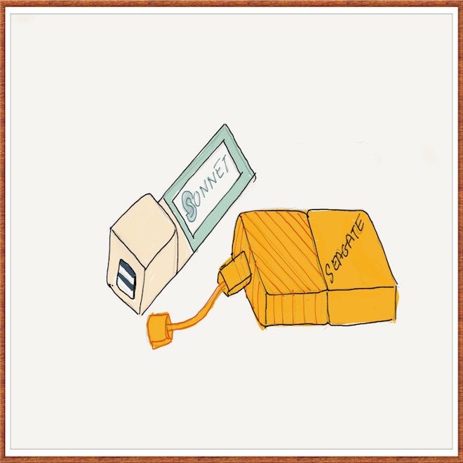

I have 3 Seagate GoFlex drives as described below.

My Macbook Pro has one Firwire 800 port, one Firewire 400 port, 2 USB 2.0
ports. But as you can see above, the Seagate portable 1 TB drive comes with a
USB 3.0 interface. I can as well connect it to a USB 2.0 port but that would be
a sheer waste. Further despite all permutations and combinations, I can at the
most end up with only one free USB 2.0 port. But I also have an express card
slot and I can easily add two USB 3.0 ports using an express card such as [this
one by Sonnet](http://www.sonnettech.com/product/usb3expresscard34.html).
Finally I decided to go with the following configuration.

I ordered the Sonnet express card through SYW and when it arrived I installed
the driver as per the instructions, restarted my Mac, connected the two USB 3.0
drives, but the drives were not recognized. The LEDs on the two drives were
blinking. A bit of investigation showed me that the express card would need an
external power supply if the power drawn by the USB device(s) is more than what
the card can provide. This was also verifed when I looked at the key features
on the overview page of the Sonnet Express card.

I then connected an external +5V 3.5mm power supply and bingo the drives were
up and running. So if you have such an express card and have connected devices
that do not seem to work, check out the power requirements. With this setup not
only do I get higher speeds for my external drives, but I also have freed up 2
USB 2.0 ports on the laptop. Very useful.

